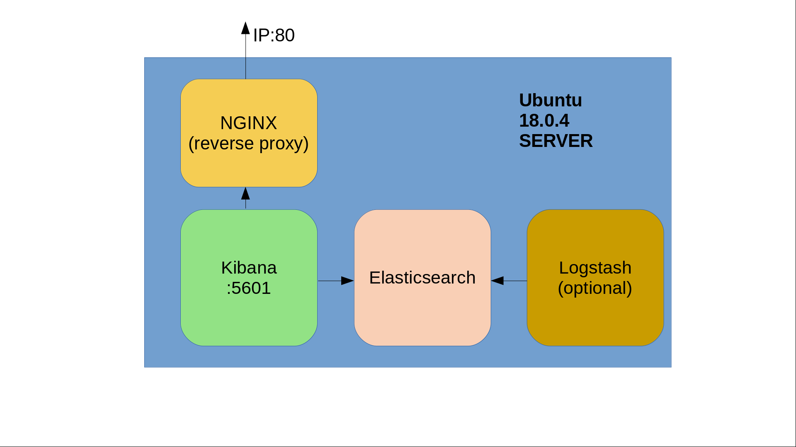

# ELK deployment 

This code implements a declarative deployment of elasticsearch and kibana dashboard on a single VM.

## Getting Started

The only dependecies should be a Vagrant and a working VirtualBox installation on your local machine.

### Prerequisites

Download and run the latest Vagrant installer for your OS (vesrion>2.0) using below link:

```
https://www.vagrantup.com/downloads.html
```

Download and install the latest Virtualbox package for your OS using below link:

```
https://www.virtualbox.org/wiki/Downloads
```

### Installation

The deployment needs a place to run. Hence, we need a vagrant linux box in order to get the environment up and running. I have chosen 
an Ubuntu LTS version (18.04) box for my deployment. Please follow the steps below to download locally the required box:


```
1)run: vagrant box add bento/ubuntu-18.04 
2)choose virtualbox
```

Above command need to be run once per host.

## Architecture



A top level view of the architecture is visible on the icon above or ARCHITECTURE.png file included as a document in this repo. General deployment info:

The code deploys a VM and installs elasticsearch and kibana on it. However, those tools are being provided by elastic (https://www.elastic.co/) and are bits of the so-called ELK (elasticsearch, logstash, kibana) stack. Hence, a task that installs logstash is also included in the solution playbook for future use but currently it is commented out. Elasticsearch is used as an open-source, RESTful, distributed search and analytics engine built on Apache Lucene (NoSQL-like DB). Kibana lets you visualize your Elasticsearch data and navigate the Elastic Stack and Logstash is a plugin-based data collection and processing engine. Usually logstash pushes data to elasticsearch and those data are being visualized through Kibana. In order to serve Kibana an NGINX server was used.

In order to deploy above services and based on the assignment's suggested technologies i have built my implementation using below tools:

>Vagrant 

Simple to use and run. Although it is mostly being used for generating reproducible testing environments, we needed an automated and portable way for bringing up our servers. 
However, provisioning is being handled with Ansible. Hence, moving the deployment to other envs (e.g. a public cloud) would be a straighforward process.

>Virtualbox 

Running and installing it is hassle-free on most operating systems. Also Vagrant's hypervisor driver works great with it.

>Ansible 

A configuration management tool for handling the package installations and generally the env provisioning. Ansible (and CM tools) would also help us structure an idempotent solution.

## How to Deploy

The project consists of the following files and dirs:

```
/elk_deployment/:

    README.md: what you're currently reading!

    ARCHITECTURE.png: A simple diagram visualizing the deployment's architecture.

    provision/: Directory holding our ansible playbooks.

    templates/: Modified configuration templates for our services.

    Vagrantfile: File being consumed by vagrant to orchestrate the deployment. 

    vagrant.yml: File used for defining some environment specific variables (VM IPs, ports etc.)
```

All files needed for bringing up the environment exist inside the directory _elk_deployment_ . The whole process is being orchestrated using a 
Vagrantfile. Below commands are sufficient to handle the deploy/destroy/provision of the elk env:

Bring up the env:
```
cd elk_deployment
vagrant up
```

Destroy the env:
```
cd elk_deployment
vagrant destroy
```

Run only the provisioning steps:
```
cd elk_deployment
vagrant provision
```

Access Kibana dashboard:
```
<VM_IP>:80
default username:password is admin/admin
```

Kibana's sample data can be used for experimentation and to familiarize with the environment.

** NOTE! The current installation uses a default IP and password for accessing Kibana. If you want to change the default IP or the default username/password being used for accesing Kibana modify the following file: **
```
/elk_deployment/vagrant.yml
```

Same IP is being passed as variable to the ansible hosts configuration file:
```
/elk_deployment/provision/hosts.yml
```

** Hence, you only need to change /elk_deployment/vagrant.yml file. **

Once the environment is up and running the provisioning is being handled using below files:

>provision/playbook.yml 

The playbook.yml handles all the installation and configuration steps to bring up the elk environment. This playbook is being used to install the required packages, setup the environment and start the services. Specifically, the playbook.yml plays 
the setup_elk role on all nodes specified in hosts.yml file. However, our scenario contains only one VM. The file hierarchy is visible below:

```
└── roles
    └── setup_elk
         ├── handlers
         │   └── main.yml
         └── tasks
             ├── elasticsearch.yml
             ├── kibana.yml
             ├── logstash.yml
             ├── main.yml
             ├── nginx.yml
             └── prereq.yml


```

### setup_elk role

** setup_elk Tasks: **

Below are the tasks we're using
```
└── tasks
    ├── elasticsearch.yml
    ├── kibana.yml
    ├── logstash.yml
    ├── main.yml
    ├── nginx.yml
    └── prereq.yml

```

>main.yml

This is the the setup_elk role entry point. 

>prereq.yml

Trying not to rely on the underlying OS, i am installing some packages that are considered to be prerequisites for my deployment and installation. Here i am installing curl, wget, gpg-agent as well as java8 which is needed to run logstash.

>elasticsearch.yml

Used for installing elasticsearch service on the VM. Elastic's latest apt repo is being added in the sources.list and then elasticsearch is being installed.

>kibana.yml

Used for installing kibana service on the VM. Elastic's latest apt repo has aleady been added from previous step so installation is executed directly. Once package is installed we're updating
its configuration using our custom config files from /elk_deployment/kibana templates directory.

>logstash.yml 

(Currently disabled) Used for installing logstash service on the VM. Elastic's latest apt repo has aleady been added from previous step so installation is executed directly.

>nginx.yml

Installs the latest nginx server and set it up as a reverse proxy to serve kibana. Configuration is being updated using the templates available in /elk_deployment/templates/nginx dir. We're also setting a password for accessing kibana dashboard. Then, we're checking that no errors exist in the conf file using nginx's built-in functionallity and then we reload the service. Nginx is able to close any existing connections gracefully when executing the reload command so we do not have any downtime.

** setup_elk Templates: **

```
├── templates
│   ├── elasticsearch
│   ├── kibana
│   │   └── kibana.yml
│   ├── logstash
│   │   └── logstash.yml
│   └── nginx
│       └── nginx.conf

```

Each service has its own configuration files and they are being injected into a specific location in the instance using the Vagrantfile (file provisioner).

>elasticsearch/

Currently empty. No changes were needed.

>kibana/kibana.yml

Modified configuration file for kibana. Sets up the listening port and listening ip.

>logstash/logstash.yml

Default configuration file for logstash. Since it is currently disabled no changes were applied. Included here for future use.

>nginx/nginx.conf

The custom configuration file for setting up nginx as a reverse proxy. Currently listening on port 80 exposing kibana's dashboard. 


**  setup_elk Handlers: **

```
├── handlers
    └── main.yml
```
>main.yml

Handlers for triggering events at the end of the playbook. Currently a handler that reloads nginx exist.

## Future Improvements

Install logstash forwarder on a machine and send some log traffic to logstash-> then create some indexes and send them to -> elasticsearch, analyze them and push them to -> kibana for visualizing the data.

Install a monitoring agent through ansible during deployment time so that we get a clear view of what is happening (resources utilization, proccesses etc.).

A Jenkinsfile where stages of the deployment, testing etc. can easily be seen should be come handy for CI purposes.

## Built With

* [Ansible](https://www.ansible.com/) - Configuration Management
* [Vagrant](https://www.vagrantup.com/) - Build and maintain portable virtual software development environments
* [Virtualbox](https://www.virtualbox.org/) - A cross-platform hypervisor
* [Elasticsearch, Kibana, Logstash](https://www.elastic.co/) - An end-to-end log analysis solution

## Useful links

* https://docs.ansible.com/ansible/latest/modules/modules_by_category.html (ansible modules main page)
* https://logz.io/learn/complete-guide-elk-stack/#installing-elk (tutorial on elk installation)
